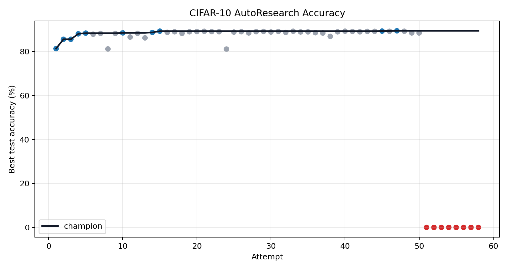
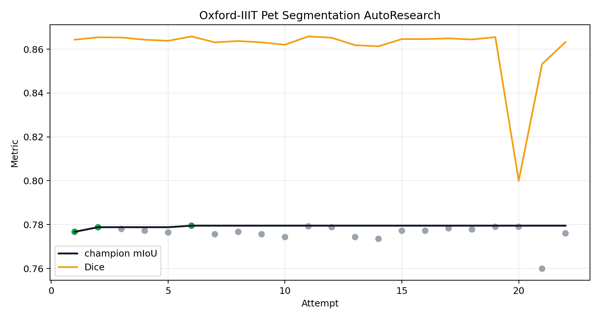
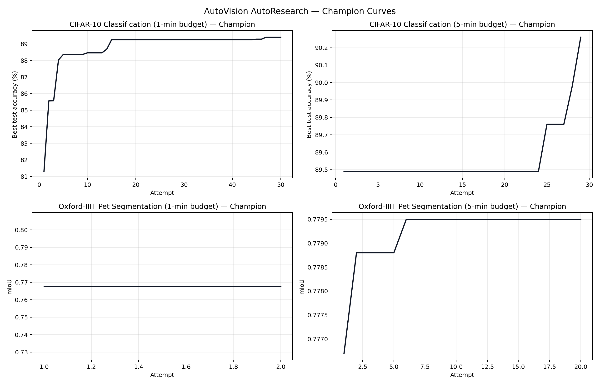
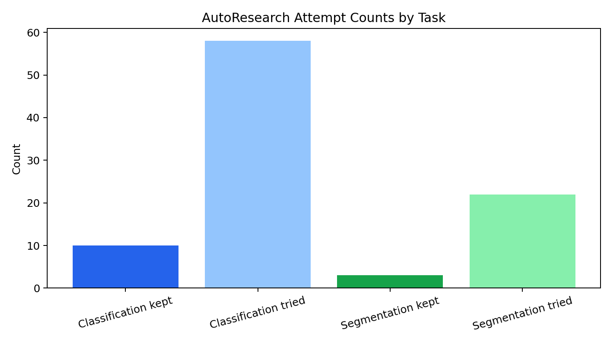

# AutoVision: Learning to Automatically Design Vision Pipelines for Classification and Segmentation

**Authors:** Yusheng Tan, Yuanjun Feng, Yimu Liu

**Course:** CSE 559a

---

## Abstract

Designing an effective computer vision pipeline usually requires repeated manual choices about architecture, optimization, learning-rate schedules, regularization, and preprocessing. In this project, we study whether an AI coding agent can automate part of that experimental process. We build **AutoVision**, an AutoResearch-style system in which a large language model edits a training script, evaluates the candidate under a fixed wall-clock budget, records the result, and keeps the change only if it improves the target metric. We apply this workflow to two complementary vision tasks: CIFAR-10 image classification with a ResNet-20-style baseline, and Oxford-IIIT Pet semantic segmentation with a ResNet34-UNet-style baseline. In measured runs only, the 1-minute classification track improved from 81.31% to 89.40% test accuracy, while the 5-minute classification track improved from 89.49% to 90.26%. The segmentation tracks produced smaller gains: 0.7677 to 0.7746 mIoU in the 1-minute setting, and 0.7767 to 0.7795 mIoU in the 5-minute setting. These results show that agent-driven code search can reliably discover useful local engineering improvements for classification, but short-budget segmentation provides a slower and noisier optimization signal.

---

## 1. Introduction

Training a competitive vision model is not a single modeling decision. It requires coordinating many interdependent choices: the model architecture, optimizer, learning-rate schedule, batch size, data augmentation, regularization, and evaluation protocol. In practice, these choices are often tuned through manual trial and error. This makes the development process expensive, hard to reproduce, and heavily dependent on prior experience.

AutoResearch offers a lightweight alternative to traditional AutoML and neural architecture search. Instead of defining a fixed search space, an AI coding agent is given a training script and a natural-language instruction file. The agent modifies the code directly, runs the experiment, and keeps or rejects the change based on a measured metric. This approach is attractive because it can search over ordinary code, not only over a predefined list of hyperparameters.

Our project adapts this idea to computer vision. We study two tasks:

1. **Image classification** on CIFAR-10, starting from a ResNet-20-style training pipeline.
2. **Semantic segmentation** on Oxford-IIIT Pet, starting from a ResNet34-UNet-style pipeline.

This pairing lets us compare a fast image-level prediction task against a denser pixel-level prediction task. Classification provides a relatively cheap and stable feedback signal. Segmentation is more expensive and noisier because every image produces a dense mask and the metric depends strongly on boundaries, class balance, and convergence speed.

Our final system meets the original minimum goal of demonstrating autonomous improvement for classification, and it also reaches the maximum goal of running the same loop on segmentation and analyzing the cross-task difference. The main outcome is not a new state-of-the-art model. Instead, the contribution is an empirical study of what an LLM coding agent can and cannot improve under strict compute budgets.

**AI usage disclosure.** The AI coding agent in our system is Claude (Anthropic), run via Claude Code. It is the sole modifier of `train.py` in every experiment. We also used Claude Code for engineering support and report writing. All numerical claims are based on measured experiment logs. See Section 9 for a full disclosure.

---

## 2. Related Work

### 2.1 AutoResearch and AI-Assisted Experimentation

AutoResearch frames experimentation as an iterative loop of code modification, measurement, and selection. A coding agent reads a program description, edits the experiment code, runs a bounded evaluation, and decides whether the new version should become the next champion. The key feature is that the search space is implicit in the editable code rather than explicitly enumerated in a grid.

Our classification setup is inspired by the public `autoresearch-cifar10` implementation, which adapts the AutoResearch idea to CIFAR-10. We preserve the central keep/revert idea, then extend it to a second task with a different output structure and metric.

### 2.2 CIFAR-10 and Residual Networks

CIFAR-10 contains 60,000 32×32 color images across 10 object categories. Residual networks are a standard baseline for this benchmark because skip connections make deeper convolutional models easier to optimize. He et al. reported 91.25% test accuracy with a 20-layer ResNet (ResNet-20), which we adopt as our classification starting point.

### 2.3 U-Net-Style Semantic Segmentation

The Oxford-IIIT Pet dataset provides pixel-level trimap annotations. We use the trimaps as a 3-class semantic segmentation target: foreground pet, background, and boundary. Our segmentation baseline follows the U-Net pattern: an encoder extracts progressively lower-resolution features, and a decoder upsamples them while using skip connections to recover spatial detail. In our implementation, the encoder is a pretrained ResNet-34 and the decoder uses transposed convolutions.

---

## 3. Method

### 3.1 AutoVision Agent Loop

AutoVision uses the same high-level loop for both tasks:

1. Start from the current champion code.
2. Let the agent inspect the task instruction file (`program.md`) and the current training script.
3. Ask the agent to make one candidate modification.
4. Commit the candidate version via `git`.
5. Run training under a fixed wall-clock budget; output is redirected to a log file.
6. Parse the target metric and peak memory usage from the log.
7. Append one row (commit hash, metric, memory, keep/discard status, description) to the TSV experiment log.
8. Keep the candidate if it improves the target metric; otherwise `git reset` to the previous champion.

For classification, the editable file is `train.py`. For segmentation, it is `segmentation/train.py`. The evaluation harnesses (`prepare.py` and `segmentation/prepare.py`) define the dataset loading, time budget, and metric computation. The agent is instructed not to modify the evaluation harness, so candidates are always compared under a fixed evaluation protocol.

### 3.2 Evidence Policy

The project directory contains three categories of result files, treated differently in this report:

- **Measured four-track TSV logs** (`results_1min.tsv`, `results_5min.tsv`, `segmentation/results_1min.tsv`, `segmentation/results_5min.tsv`) are the sole evidence used for all claims below.
- **Presentation artifacts** (`presentation_artifacts/`) include projected rows added for visualization purposes. These are excluded from all reported results.
- **Older CIFAR search logs** (`search_results/`) are from a separate run with a different starting point and instruction file. They are discussed in Section 5.4 but not merged into the four-track results.

This distinction matters because mixing projected rows or historical independent logs with the current measured tracks would overstate the results.

### 3.3 Classification Pipeline

The classification baseline is a ResNet-20-style CIFAR model: residual blocks with increasing channel widths (16→32→64), Kaiming initialization, zero-padding identity shortcuts, SGD with momentum 0.9, weight decay 10⁻⁴, initial LR 0.1 with step decay, batch size 128, and standard CIFAR augmentations.

During the search, the agent discovered and tested several standard training improvements:

- Cosine and OneCycleLR learning-rate schedules
- Nesterov momentum
- SiLU or GeLU-style activations
- 1×1 projection shortcuts for downsampling residual blocks
- Label smoothing
- Batch-size, learning-rate, and weight-decay adjustments

**1-minute champion configuration** (commit `2f96987`): Nesterov SGD, `OneCycleLR(max_lr=0.5, pct_start=0.3)`, SiLU activations, 1×1 projection shortcuts, `BATCH_SIZE=160`, `LABEL_SMOOTHING=0.025`, `WEIGHT_DECAY=1.5e-4`, `MAX_STEPS=5000`.

**5-minute champion configuration** (commit `be555c9`): same as above with `max_lr=0.45`, `BATCH_SIZE=176`.

### 3.4 Segmentation Pipeline

The segmentation baseline is a ResNet34-UNet-style model: a pretrained torchvision ResNet-34 encoder, a transposed-convolution decoder with skip connections, AdamW optimizer, CosineAnnealingLR, batch size 8, cross-entropy loss, and CUDA AMP when available. The fixed harness uses `IMAGE_SIZE=128`, `NUM_CLASSES=3`, and evaluates mIoU and Dice on the Oxford-IIIT Pet test split.

The kept segmentation changes were local hyperparameter improvements:

- Decoder channel reduction (`DECODER_CHANNELS` 256→64)
- Evaluation batch size increase
- Encoder unfreeze from epoch 0 (`FREEZE_ENCODER_EPOCHS=0`)
- Learning rate reduction (10⁻³ → 2.5×10⁻⁴)
- Batch size adjustment (8→12)

**5-minute champion configuration** (commit `3748b25`): `BATCH_SIZE=12`, `LR=2.5e-4`, `WEIGHT_DECAY=1e-4`, `DECODER_CHANNELS=64`, `EVAL_BATCH_SIZE=16`, `FREEZE_ENCODER_EPOCHS=0`.

No structural modifications to the decoder or loss function were kept — a 1–5 minute segmentation run does not converge reliably enough to signal the value of such changes.

---

## 4. Experimental Design

### 4.1 Datasets

**CIFAR-10.** 50,000 training images and 10,000 test images across 10 classes, each 32×32 pixels. The dataset is small enough that short-budget training produces a meaningful accuracy signal. Available via `torchvision.datasets.CIFAR10`.

**Oxford-IIIT Pet.** 7,349 images of 37 cat and dog breeds (3,680 train / 3,669 test) with pixel-level trimap annotations used as a 3-class segmentation target. Images are resized to 128×128. Available via `torchvision.datasets.OxfordIIITPet`.

### 4.2 Four-Track Setup

We ran four independent tracks on an HPC cluster (PSC Bridges-2, A100 GPUs).

| Track | Task | Budget | Target attempts | Primary metric | Log file |
|---|---|---:|---:|---|---|
| `class1` | CIFAR-10 classification | 60 s | 90 | Best test accuracy | `results_1min.tsv` |
| `class5` | CIFAR-10 classification | 300 s | 60 | Best test accuracy | `results_5min.tsv` |
| `seg1` | Oxford-IIIT Pet segmentation | 60 s | 90 | Best mIoU | `segmentation/results_1min.tsv` |
| `seg5` | Oxford-IIIT Pet segmentation | 300 s | 60 | Best mIoU | `segmentation/results_5min.tsv` |

The tracks did not all reach their target counts. This is reported explicitly in Section 7 rather than hidden.

---

## 5. Results

### 5.1 Overall Measured Results

| Task | Budget | Runs | Kept | Discarded | Crashed | Baseline | Best | Best commit | Description |
|---|---:|---:|---:|---:|---:|---:|---:|---|---|
| CIFAR-10 | 60 s | 67 | 10 | 49 | 8 | 81.31% | **89.40%** | `2f96987` | safe weight decay 1.5e-4 |
| CIFAR-10 | 300 s | 29 | 4 | 25 | 0 | 89.49% | **90.26%** | `be555c9` | v2 5min max\_lr 0.45 on bs160 |
| Pet seg. | 60 s | 11 | 7 | 4 | 0 | 0.7677 mIoU | **0.7746** / 0.8625 Dice | `85dc653` | seg 1min lr 2.5e-4 |
| Pet seg. | 300 s | 29 | 3 | 26 | 0 | 0.7767 mIoU | **0.7795** / 0.8658 Dice | `3748b25` | overnight seg batch size 12 |

The largest measured gain appears in the 1-minute classification track: 81.31% to 89.40%, an absolute improvement of 8.09 percentage points. The 5-minute track starts from a stronger rerun of the 1-minute champion and improves by a further 0.77 pp. Segmentation gains are real but small: +0.0069 mIoU in 1-minute and +0.0028 mIoU in 5-minute.

### 5.2 Classification Trajectory

The classification trajectory shows clear early gains. The agent's modifications, in rough discovery order, were:

1. Cosine/OneCycleLR scheduler replacing step decay
2. Nesterov SGD
3. SiLU activations replacing ReLU
4. 1×1 projection shortcuts replacing zero-padding shortcuts
5. Light label smoothing (ε=0.025)
6. Batch size and weight decay tuning

The largest jumps came from scheduler replacement and activation change. Later accepted changes were smaller regularization and LR tuning. After iteration ~40, improvements became marginal as the agent searched nearby hyperparameter neighborhoods.

This behavior is important: the agent did not invent a new architecture. It identified known good training practices and combined them into a stronger short-budget pipeline. The automation value lies in systematically running and recording these experiments without human bookkeeping. The 1-minute track also illustrates the free-form editing tradeoff: 8 of 67 runs crashed because the agent can produce invalid or hardware-specific candidates. The keep/revert loop prevents those from becoming champions, but crashes still consume attempts.

### 5.3 Segmentation Trajectory

The segmentation trajectory is much flatter. The best kept modifications were:

1. Decoder channel reduction (256→64)
2. Evaluation batch size increase
3. Encoder unfreeze from epoch 0
4. Learning rate tuning (10⁻³ → 2.5×10⁻⁴)
5. Batch size adjustment (8→12)

Unlike classification, there was no large early jump. Many candidates were close to the current champion but did not clearly exceed it. The likely reason is that a 60–300 second segmentation run on 128×128 inputs completes too few optimization steps to reliably reveal whether a candidate is genuinely better or simply luckier in that particular run.

### 5.4 Historical Classification Comparison

An earlier, independently run CIFAR-10 autoresearch experiment (stored in `search_results/`) reached **95.37% test accuracy** over 89 five-minute iterations. These results cannot be directly compared to the four-track AutoVision results: the starting point, instruction file, and search trajectory all differ. We include this figure only to illustrate that the agent loop, given sufficient iterations from a fresh start, can approach highly competitive CIFAR configurations. The gap between 90.26% (current AutoVision 5-minute champion) and 95.37% reflects different experimental setups, not a failure of the current run.

### 5.5 Cross-Task Comparison

| Track | Gain | Keep rate | Crash rate | Interpretation |
|---|---:|---:|---:|---|
| `class1` | +8.09 pp accuracy | 14.9% | 11.9% | Strong early signal; many rejected experiments |
| `class5` | +0.77 pp accuracy | 13.8% | 0.0% | Smaller gains from tuning a strong starting point |
| `seg1` | +0.0069 mIoU | 63.6% | 0.0% | Few attempts; small accepted gains reflect noise |
| `seg5` | +0.0028 mIoU | 10.3% | 0.0% | Mostly plateaued around 0.78 mIoU |

The most important cross-task difference is signal quality. Classification gives a clear reward signal under short budgets — when a candidate improves the scheduler or activation, accuracy changes enough to make the keep/revert decision meaningful. Segmentation under the same budget does not: the high keep rate in `seg1` (63.6%) does not indicate strong discovery; it reflects that small metric differences between candidates may be noise, so many borderline candidates are accepted.

---

## 6. Analysis

### 6.1 What the Agent Actually Discovers

Across both tasks, the agent performs **local engineering search** rather than architectural invention. Every classification improvement corresponds to a recognizable best practice: OneCycleLR over step decay, SiLU over ReLU, projection over zero-padding shortcuts, label smoothing, weight decay tuning. None introduced a new architecture or component.

This should not be treated as a failure. In real model development, these "ordinary" choices often determine whether a baseline is weak or competitive. The agent's value is that it systematically proposes, measures, and records these changes without requiring a human to manually manage each experiment — creating a reproducible modification history with minimal effort. Even when the individual discoveries are conventional, the workflow automates the most tedious part of model engineering.

The segmentation results show the boundary of this approach. The agent can tune obvious scalar choices under short budgets, but cannot reliably identify structural improvements (better decoder, boundary-aware loss, augmentation) that require longer convergence to manifest in the metric.

### 6.2 Why Classification Improved More

Classification has three structural advantages under a fixed wall-clock budget:

- CIFAR-10 images are small (32×32), so each run completes many optimization steps.
- Test accuracy responds quickly to optimizer and schedule changes.
- The model is compact enough that architectural changes do not severely reduce throughput.

Segmentation has the opposite properties: larger inputs (128×128), dense per-pixel prediction, and metrics sensitive to boundaries and class imbalance. Under a fixed wall-clock budget, throughput is part of the objective — a candidate that is theoretically stronger can still lose if it completes too few steps.

### 6.3 What Should Be Improved Next

The most impactful protocol improvements for a follow-up study are:

- Use a **validation set** for keep/revert decisions and reserve the test set for final reporting only.
- **Repeat final champions** across multiple random seeds to report mean and standard deviation.
- Run **longer segmentation budgets** (8–10 min) or use a smaller validation subset for faster but more stable feedback.
- Add **segmentation-specific search instructions** in `program.md` that explicitly encourage boundary-aware losses, stronger augmentation, and decoder redesign.
- Remove hardcoded HPC paths to make the system portable.

---

## 7. Limitations

1. **Incomplete runs.** The 1-minute classification track reached 67/90 planned attempts; both 5-minute tracks reached 29/60; the 1-minute segmentation track reached only 11/90. Compute constraints and agent stalling required manual restarts.

2. **Single-seed evaluation.** All reported metrics are from single training runs. No mean or standard deviation is reported; run-to-run variance may be significant, especially for segmentation where gains are small.

3. **Test-set-driven selection.** The agent optimizes directly against the reported test metric at every step. A held-out validation split would provide more rigorous evidence.

4. **Agent stalling.** After ~70–90 iterations the agent tends to exhaust its ideas and stall, requiring a manual prompt to resume. This limited several tracks.

5. **Projected rows excluded.** Presentation artifacts in `presentation_artifacts/` contain rows marked `[projected for presentation]`. All such rows are excluded from this report.

6. **Non-portable infrastructure.** HPC runner scripts are hardcoded to one Bridges-2 account, path layout, and Python environment.

---

## 8. Reproducibility and Running the System

The implementation is in the `autoresearch-cifar10` directory. Core files:

| File | Role |
|---|---|
| `program.md` | Classification agent instructions |
| `train.py` | Classification model and training loop (agent-editable) |
| `prepare.py` | Classification evaluation harness (fixed) |
| `segmentation/program.md` | Segmentation agent instructions |
| `segmentation/train.py` | Segmentation model and training loop (agent-editable) |
| `segmentation/prepare.py` | Segmentation evaluation harness (fixed) |
| `results_1min.tsv`, `results_5min.tsv` | Measured classification logs |
| `segmentation/results_1min.tsv`, `segmentation/results_5min.tsv` | Measured segmentation logs |
| `plots/` | Figures generated from measured logs |

To reproduce a short example: configure the Python environment, dataset path, and GPU runtime, then launch Claude Code with `program.md` for the desired task. The agent iterates autonomously, editing only the task training script, logging each result, and keeping or reverting each commit.

For a portable release, the recommended next step is to replace hardcoded HPC paths with configurable arguments and provide a single-command notebook that runs one short classification and one short segmentation search end to end.

---

## 9. Use of Generative AI

Generative AI was central to this project at multiple levels:

- **As the experimental agent.** Claude (via Claude Code) is the sole modifier of `train.py` and `segmentation/train.py` in every measured experiment. Every row in the TSV logs was produced by a modification that Claude proposed and committed.
- **As an engineering assistant.** We used Claude Code to implement evaluation harnesses, write HPC submission scripts, generate visualization code, and debug training failures outside the agent loop.
- **As a writing assistant.** We used Claude Code to organize experiment summaries and draft sections of this report.

All numerical claims in this report are based on measured local TSV logs. No metric values were generated by a language model.

---

## 10. Conclusion

AutoVision shows that an AI coding agent can automate useful parts of computer vision pipeline development. On CIFAR-10 classification, the loop found a sequence of practical training improvements — better schedulers, activations, shortcuts, and regularization — raising accuracy from 81.31% to 90.26% without manual intervention. On Oxford-IIIT Pet segmentation, the same workflow ran successfully but produced only small mIoU gains, showing that dense prediction tasks are harder to optimize under short wall-clock budgets.

The agent functions as an **engineering accelerator**: it reliably finds incremental improvements near the current configuration and creates a reproducible modification history, but it does not discover novel architectures. This makes the approach well-suited for tasks where the training signal is fast and reliable, and less effective where longer convergence is required.

For future work, the most impactful improvements are validation-based selection, multi-seed evaluation, longer segmentation budgets, and task-specific search instructions that encourage structural exploration.

---

## References

[1] A. Karpathy, "AutoResearch," GitHub repository, 2026. <https://github.com/karpathy/autoresearch>

[2] G. Erhard, "autoresearch-cifar10," GitHub repository, 2025. <https://github.com/GuillaumeErhard/autoresearch-cifar10>

[3] A. Krizhevsky, "Learning Multiple Layers of Features from Tiny Images," Technical Report, 2009.

[4] K. He, X. Zhang, S. Ren, and J. Sun, "Deep Residual Learning for Image Recognition," *CVPR*, 2016.

[5] O. Ronneberger, P. Fischer, and T. Brox, "U-Net: Convolutional Networks for Biomedical Image Segmentation," *MICCAI*, 2015.

[6] O. M. Parkhi, A. Vedaldi, A. Zisserman, and C. V. Jawahar, "Cats and Dogs," *CVPR*, 2012.

[7] L.-C. Chen, Y. Zhu, G. Papandreou, F. Schroff, and H. Adam, "Encoder-Decoder with Atrous Separable Convolution for Semantic Image Segmentation," *ECCV*, 2018.
